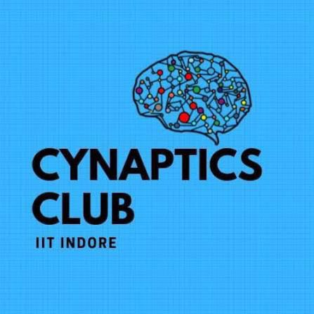

# Cynaptics Induction Tasks March 2026

We are the Cynaptics Club of IIT Indore, the AI/ML enthusiasts' hub, and we're excited to present you with our induction task!

Submission guidelines and detailed explanations for each task can be found in their respective task folders. Best of luck, and we look forward to your innovative solutions!

# Task 1

## Make your own GPT: The "Glorified Autocomplete" (GPT-2 Pretraining)

Build a scaled-down, **decoder-only Transformer** (GPT-2 style) from scratch using **PyTorch** and train it on the [Tiny Shakespeare] dataset. The goal is to autocomplete the text — essentially a highly complex autocomplete.**The model architecture should be based on GPT-2 but you are free modify it.**

### Core Deliverables
1. **Data Loader** — Tokenize the dataset into input/target pairs (shifted by one token).
2. **Transformer Architecture** — Masked Self-Attention, Multi-Head Attention, Feed-Forward Networks, Positional & Token Embeddings.
3. **Pretraining Loop** — Train with Cross-Entropy Loss over multiple epochs.
4. **Text Generation** — Sample from the model's probability distribution to generate Shakespeare-esque text.

> **Note:** You have to attempt Task-1 before moving to Task 2.

Full details, milestones, and submission guidelines are in the [Task 1 folder](./Task1/).
