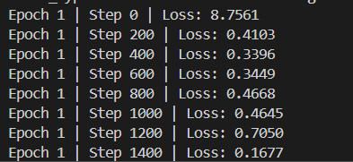

# Task 2 — Supervised Fine-Tuning of GPT-2 on Alpaca

For this task I fine-tuned the pretrained GPT-2 (124M) model from Hugging Face on the Stanford Alpaca dataset so it can follow instructions and reply like a conversational assistant. Unlike Task 1 where I built everything from scratch, here the idea is transfer learning — GPT-2 already understands language, I just needed to teach it a new format and behaviour.

---

## What I Did

I loaded the pretrained `openai-community/gpt2` model and fine-tuned it on ~52,000 instruction-following examples from the Alpaca dataset. Each example has an instruction, an optional input, and an expected output — all formatted into the standard Alpaca prompt template before being fed to the model. The model learns by predicting the next token across the entire formatted sequence, which is how it picks up the assistant-style response pattern.

The dataset is split 90/10 into train (~46,800 examples) and validation (~5,200 examples). I used a 90/10 train/test split giving ~46,800 training examples and ~5,200 for validation.

---

## Training Progress

> **Note:** Training is still ongoing at the time of submission. The model is being fine-tuned on the full Alpaca dataset on an A100 GPU. Below is a screenshot of the training loss mid-way through Epoch 1.

The loss dropped from **8.75 at Step 0 to 0.16 by Step 1400**. This rapid drop makes sense — GPT-2 already understands language from pretraining, so it adapts to the Alpaca instruction format very quickly. The slight fluctuations in between are normal during fine-tuning.

---

## Hyperparameters

| Parameter | Value |
|---|---|
| Base model | GPT-2 (124M parameters) |
| Dataset | tatsu-lab/alpaca (~52K examples) |
| Epochs | 3 |
| Batch size | 4 |
| Learning rate | 2e-5 |
| Max sequence length | 512 tokens |
| Optimizer | AdamW |
| Gradient clipping | 1.0 |

The learning rate of 2e-5 is intentionally small — if it's too high you overwrite the pretrained weights rather than gently steering them. Fine-tuning is about nudging, not retraining. 3 epochs is enough since GPT-2 already knows language and just needs to learn the instruction-response format.
